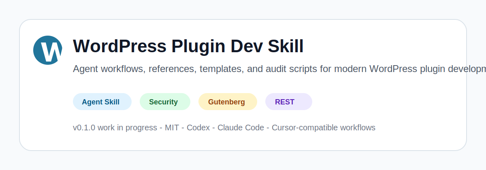

# WordPress Plugin Dev Skill

[](LICENSE)




A professional Agent Skill for building, reviewing, testing, and releasing modern WordPress plugins with Codex, Cursor, Claude Code, and other Agent Skills-compatible tools.

Status: `v0.1.0` work in progress. Useful today, but intentionally honest about limitations.

## What Is This?

`wordpress-plugin-dev` is a portable Agent Skill that gives AI coding agents WordPress-specific workflows, reference notes, templates, and local scripts. It helps agents work more like experienced WordPress plugin engineers instead of generic PHP/JavaScript assistants.

The canonical skill lives in:

```text
skills/wordpress-plugin-dev/
```

Generated install-target copies live in:

```text
.agents/skills/wordpress-plugin-dev/
.claude/skills/wordpress-plugin-dev/
.cursor/skills/wordpress-plugin-dev/
```

## Why This Exists

WordPress plugin development has sharp edges: capabilities, nonces, sanitization, escaping, hooks, REST API permissions, admin UI, Gutenberg blocks, i18n, accessibility, privacy, tests, Plugin Check, and WordPress.org release rules.

Generic coding agents often miss those WordPress-specific rules. This skill gives them curated workflows, source-backed references, safe starter templates, and a heuristic audit script so the first answer is closer to a professional WordPress review.

## Features

- Modern plugin architecture guidance.
- WordPress security review workflows.
- REST API and admin/settings guidance.
- Gutenberg and `block.json` workflows.
- Interactivity API notes.
- i18n, accessibility, and privacy guidance.
- WordPress.org release readiness checks.
- Safe starter templates.
- Heuristic audit script with human and JSON output.
- Compatibility notes for Codex, Cursor, Claude Code, and other Agent Skills-compatible tools.

## Repository Structure

```text
skills/wordpress-plugin-dev/
|-- SKILL.md
|-- references/
|-- assets/
|   |-- templates/
|   `-- examples/
`-- scripts/
```

Edit the canonical skill folder first, then run:

```bash
npm run sync
```

Do not edit generated install-target copies directly unless you are debugging sync behavior.

## Installation

### Codex

For local skill testing through `.agents/skills`, run:

```bash
npm run sync
```

This creates or refreshes:

```text
.agents/skills/wordpress-plugin-dev/
```

Codex plugin metadata is included in:

```text
.codex-plugin/plugin.json
```

Local marketplace metadata for testing is included in:

```text
.agents/plugins/marketplace.json
```

Where explicit skill invocation is supported, you can use:

```text
$wordpress-plugin-dev review this plugin for security issues.
```

### Claude Code

Project-level skill:

```text
.claude/skills/wordpress-plugin-dev/
```

Personal skill:

```bash
mkdir -p ~/.claude/skills
cp -R skills/wordpress-plugin-dev ~/.claude/skills/
```

Claude Code discovers project and personal skills from those folders. If slash invocation is unavailable in your version, use natural language:

```text
Use the wordpress-plugin-dev skill to review this WordPress plugin.
```

### Cursor

Cursor support for Agent Skills or skill-style workflows can vary by version and rollout. This repository includes a synchronized `.cursor/skills/wordpress-plugin-dev/` copy for workflows that support project-level skills, but verify the current Cursor docs or in-app Settings before relying on a specific path or slash invocation.

Use the canonical folder if your Cursor version offers an import/create workflow:

```text
skills/wordpress-plugin-dev/
```

When your Cursor version supports skill invocation, try:

```text
/wordpress-plugin-dev create a dynamic block with render.php
```

## Usage Examples

```text
Use wordpress-plugin-dev to create a secure WordPress plugin skeleton with Composer, @wordpress/scripts, PHPCS, and a readme.txt.
```

```text
Use wordpress-plugin-dev to audit this plugin for security, WordPress Coding Standards, Gutenberg/block.json usage, and WordPress.org release readiness.
```

```text
Use wordpress-plugin-dev to create a dynamic Gutenberg block registered with block.json and server-side render.php.
```

```text
Use wordpress-plugin-dev to review this REST API endpoint for permission_callback, nonce handling, sanitization, escaping, and WP_Error responses.
```

## Included References

| Area | File | Purpose |
| --- | --- | --- |
| Source map | `references/source-map.md` | Official source routing and version-sensitive verification rules. |
| Architecture | `references/plugin-architecture.md` | Bootstrap, lifecycle hooks, autoloading, data models, assets, and boundaries. |
| Security | `references/wordpress-security.md` | XSS, CSRF, SQL injection, capabilities, nonces, REST security, filesystem, and remediation. |
| Coding standards | `references/coding-standards.md` | WordPress PHP, JS, CSS, HTML, docs, and tooling conventions. |
| Hooks, REST, admin | `references/hooks-rest-admin.md` | Actions, filters, admin menus, Settings API, REST controllers, AJAX, and shortcodes. |
| Blocks | `references/blocks-gutenberg.md` | `block.json`, dynamic blocks, server-side registration, and build workflow. |
| Interactivity API | `references/interactivity-api.md` | When to use the Interactivity API, core concepts, warnings, and examples. |
| i18n/a11y/privacy | `references/i18n-a11y-privacy.md` | Text domains, translations, labels, focus, privacy exports/erasure, and review checklist. |
| Testing/CI | `references/testing-and-ci.md` | `wp-env`, WP-CLI scaffold tests, PHPUnit, JS tests, static analysis, Plugin Check, CI. |
| Release | `references/release-wordpress-org.md` | `readme.txt`, Plugin Check, assets, packaging, and WordPress.org readiness. |
| Review workflows | `references/review-checklists.md` | Architecture, security, block, REST, settings, release, performance, and a11y/i18n review workflows. |

## Templates

| Template | Purpose |
| --- | --- |
| `plugin-php-main.stub` | Main plugin file with headers, guards, lifecycle hooks, textdomain loading, and bootstrap. |
| `composer-json.stub` | Composer PSR-4 autoload, WPCS/PHPCS dev tooling, and PHP scripts. |
| `package-json.stub` | `@wordpress/scripts`, lint, format, build, packages-update, and plugin zip scripts. |
| `block-json.stub` | API v3 `block.json` starter for dynamic blocks. |
| `rest-controller.stub` | Class-based REST controller with args, permissions, sanitization, and `WP_Error` responses. |
| `settings-page.stub` | Settings API page with capability checks, sanitize callback, escaping, and accessible labels. |
| `readme-txt.stub` | WordPress.org-style `readme.txt` structure. |
| `github-actions-ci.yml.stub` | Starter CI skeleton for real plugin repositories. |

## Scripts

| Command | Purpose |
| --- | --- |
| `npm run validate:skill` | Validate `SKILL.md`, metadata, references, templates, scripts, and README install docs. |
| `npm run smoke` | Run validation, source-map check, audit unit tests, and demo fixture audit. |
| `npm run sync` | Copy canonical skill into `.agents`, `.claude`, and `.cursor` install targets. |
| `node skills/wordpress-plugin-dev/scripts/audit-plugin.mjs /path/to/plugin` | Run the heuristic plugin audit in human-readable mode. |
| `node skills/wordpress-plugin-dev/scripts/audit-plugin.mjs /path/to/plugin --json` | Run the heuristic plugin audit with structured JSON output. |

## Audit Script Disclaimer

The audit script is a heuristic scanner. It can find common issues, but it is not a replacement for a professional security review.

Treat findings as triage signals. Verify them against the plugin context, WordPress APIs, current official docs, and human security judgment.

## Security Model

- Scripts run locally in your workspace.
- The skill does not require secrets.
- `audit-plugin.mjs` reads plugin files and prints findings; it does not modify target plugins.
- Review generated code before using it in a real plugin.
- Verify external docs for release-sensitive tasks.
- Do not blindly trust generated plugin code, especially around auth, capabilities, nonces, SQL, filesystem operations, external requests, and privacy.

## Compatibility Notes

| Tool | Status |
| --- | --- |
| Codex | Supported as a local Agent Skill and plugin-style package via included metadata. |
| Claude Code | Supported through project and personal skill folders. |
| Cursor | Supported for skill-style workflows where the user's Cursor version supports them; verify current install path and invocation behavior. |
| Other Agent Skills-compatible tools | Use the canonical `skills/wordpress-plugin-dev/` folder and adapt installation to the tool. |

## Roadmap

- Stronger fixture tests.
- More block examples.
- Expanded Plugin Check integration.
- Better CI matrix.
- Optional docs refresh script.
- Richer audit rules for AJAX, SQL, filesystem, SSRF, and REST callbacks.

## Contributing

See [CONTRIBUTING.md](CONTRIBUTING.md).

Short version:

- Keep `SKILL.md` concise.
- Add references instead of bloating `SKILL.md`.
- Prefer official WordPress sources.
- Do not copy official docs wholesale.
- Keep templates safe by default.
- Run validation before opening a PR:

```bash
npm run validate:skill
npm run smoke
```

## License

MIT. See [LICENSE](LICENSE).
